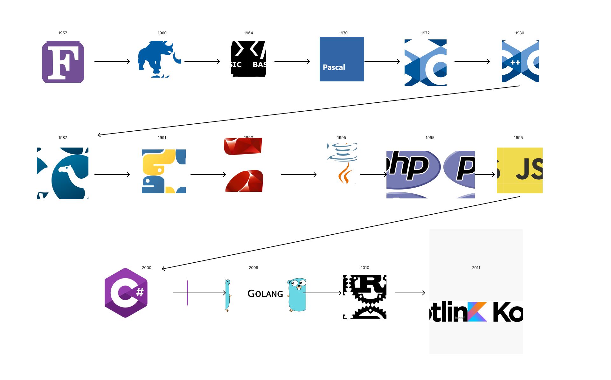

# 🧠 Desafio 01 – Introdução às Linguagens de Programação

A programação teve diversos marcos na sua evolução, e a linha do tempo a seguir, cita as principais linguagens e detalhes sobre elas

## 🕰️ Linha do Tempo da Evolução das Linguagens de Programação

| Ano      | Linguagem  | Descrição                                                                                                                   |
| -------- | ---------- | --------------------------------------------------------------------------------------------------------------------------- |
| **1957** | FORTRAN    | Focada em cálculos matemáticos e científicos. Foi a primeira linguagem de alto nível amplamente adotada.                    |
| **1959** | COBOL      | Criada para aplicações comerciais e governamentais. Ainda usada em sistemas bancários e legados.                            |
| **1964** | BASIC      | Criada para tornar a programação acessível a iniciantes, muito usada em ensino e primeiros PCs.                             |
| **1970** | Pascal     | Popular no ensino de programação estruturada. Influenciou muitas linguagens modernas.                                       |
| **1972** | C          | Extremamente influente, base para Unix e diversas linguagens como C++, Java e C#.                                           |
| **1980** | C++        | Extensão de C com orientação a objetos. Muito usada em sistemas, jogos e aplicações de alto desempenho.                     |
| **1987** | Perl       | Famosa pela flexibilidade em manipulação de texto e scripts. Muito usada na web nos anos 90.                                |
| **1991** | Python     | Conhecida pela sintaxe simples e legibilidade. Popular em ciência de dados, IA, automação e web.                            |
| **1993** | Ruby       | Linguagem dinâmica com foco em produtividade e simplicidade. Base do framework Ruby on Rails.                               |
| **1995** | Java       | Criada para portabilidade ("escreva uma vez, rode em qualquer lugar"). Amplamente usada em sistemas corporativos e Android. |
| **1995** | PHP        | Linguagem de script para web, muito usada em sites dinâmicos e sistemas como WordPress.                                     |
| **1995** | JavaScript | Começou como linguagem para navegadores. Hoje é usada no front-end, back-end e aplicações full-stack.                       |
| **2000** | C#         | Criada pela Microsoft como alternativa ao Java. Muito usada em aplicações desktop, web e jogos (Unity).                     |
| **2009** | Go         | Desenvolvida pela Google. Combina desempenho com simplicidade, ideal para sistemas e servidores.                            |
| **2010** | Rust       | Foco em segurança e performance, sem uso de garbage collector. Ganhando espaço em sistemas críticos.                        |
| **2011** | Kotlin     | Totalmente interoperável com Java. Tornou-se a linguagem oficial para desenvolvimento Android.                              |

## Conclusão

A evolução das linguagens de programação reflete tanto os avanços tecnológicos quanto as necessidades humanas, seguindo paradigmas inerentes ao período e evolução do momento.
