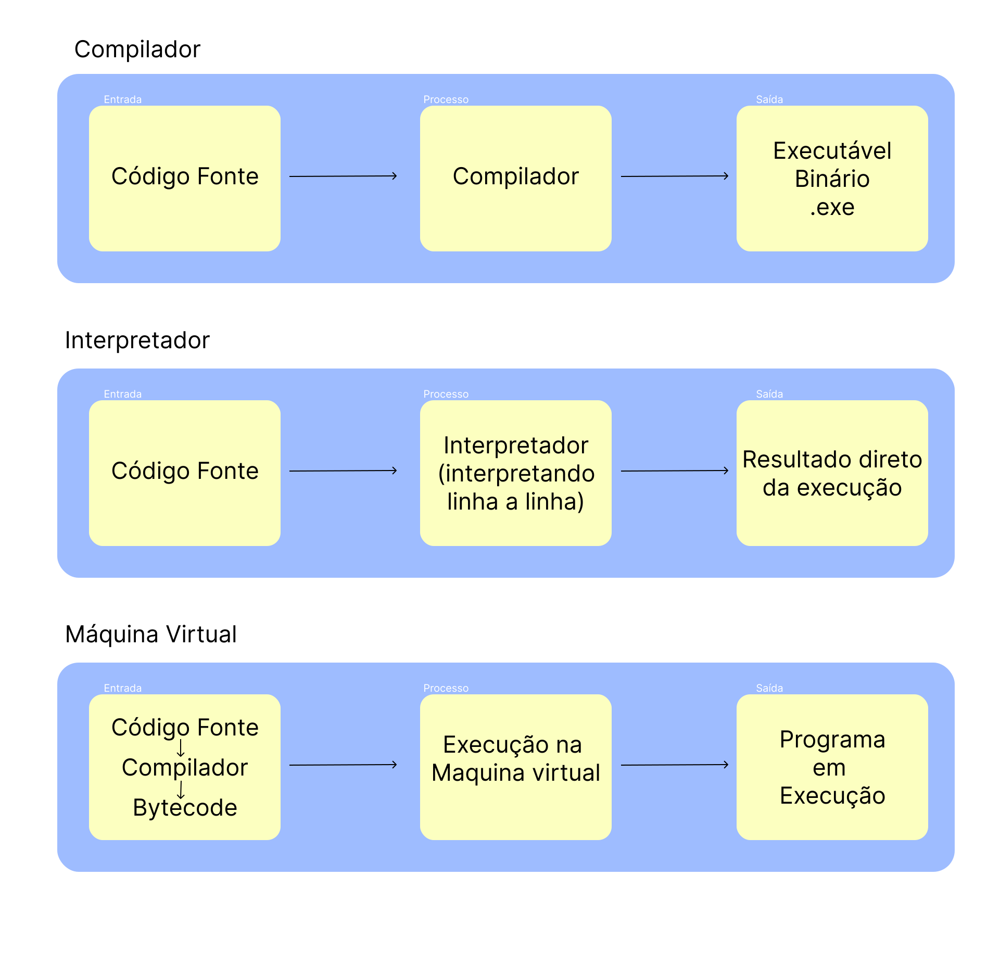

# Ambientes de Programação

Neste módulo, exploramos três componentes fundamentais para a execução de programas em diferentes linguagens: **compiladores**, **interpretadores** e **máquinas virtuais**. Cada um possui suas características e forma distinta de traduzir ou executar o código-fonte escrito pelo programador.

---

## Compiladores

O compilador é um programa que traduz **todo o código-fonte** da linguagem de alto nível para linguagem de máquina **antes** da execução. O resultado é um **arquivo executável** independente.

- **Exemplos de linguagens compiladas:**
  - C
  - C++
  - Rust
  - Go

---

## Interpretadores

O interpretador **executa o código linha por linha** diretamente, sem gerar um executável final. Isso facilita testes rápidos e depuração, mas pode ser mais lento em tempo de execução.

- **Exemplos de linguagens interpretadas:**
  - Python
  - Ruby
  - JavaScript (quando rodado no navegador)

---

## Máquinas Virtuais

A Máquina Virtual (VM) é uma camada de abstração entre o código compilado e o hardware real. Ela executa um **código intermediário (bytecode)**, permitindo portabilidade e segurança.

- **Exemplos de VMs:**
  - **JVM (Java Virtual Machine)** – usada para executar bytecode de Java e Kotlin
  - **.NET CLR (Common Language Runtime)** – usada por C#, F#, VB.NET
  - **V8 (Google)** – embora muitas vezes classificado como interpretador, o V8 compila JavaScript para código de máquina em tempo real (Just-In-Time)

---

## Comparativo de velocidade

| Característica        | Compilador | Interpretador | Máquina Virtual     |
| --------------------- | ---------- | ------------- | ------------------- |
| Geração de Executável | Sim        | Não           | Sim (intermediário) |
| Velocidade            | Alta       | Média/baixa   | Alta (com JIT)      |
| Portabilidade         | Baixa      | Alta          | Alta                |
| Exemplo               | C, C++     | Python, JS    | Java, C#            |

---

## Conclusão

Cada ambiente de programação possui suas vantagens. Compiladores oferecem desempenho, interpretadores facilitam desenvolvimento, e máquinas virtuais trazem portabilidade e robustez.
